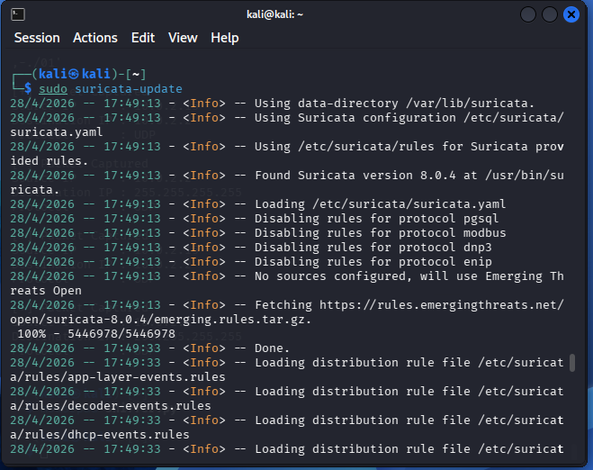
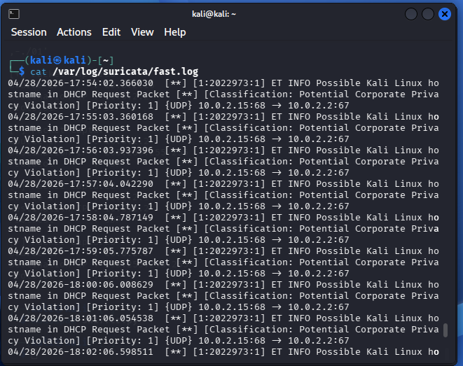
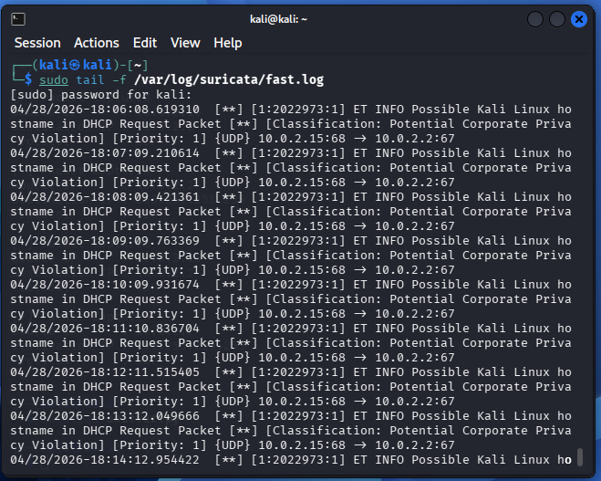

NETWORK INTRUSION DETECTION SYSTEM

TOOLS:

#KALI LINUX
#SURICATA

#Install Suricata:

sudo apt install suricata -y

#confirm suricata installed 

suricata --version

#find my network interface

ip a

#Rules/Alert Configuration:

sudo suricata-update

this downloads detection rules:

Malware patterns
Suspicious traffic
Attack behaviors

#Generated traffic:

ping google.com or curl google.com

check Alerts results

cat /var/log/suricata/fast.log 

traffic_result_suricata

#Result Breakdown:

ET INFO - Emerging Threat
Level: Informational(not an attack, but notable)

Kali Linux identified by suricata 

this can be used to fingerprint a system on the network

kali 10.0.2.15:68 - UDP 10.0.2.2:67 
meaning:

10.0.2.15 - kali machine

10.0.2.2 -  Gateway(VirtualBox NAT router)

port - 68 DHCP client port, used by kali machine
Port - 67 DHCP server port, used by dhcp server (gateway)

kali sent DHCP request (UDP)
suricata responded with acknowledgement

SUMMARY/OBSERVATION:
IDS can detect system identity and behavior patterns

Alerts are not always attacks, some are informational

#IMPLEMENT RESPONSE MECHANISMS:

configured suricata to monitor alerts in real time

sudo tail -f /var/log/suricata/fast.log

alerts_config_suricata

alerts are generated when network activity occurs.

This allows: Immediate visibility of detected events

Quick identification of suspicious activity

Real-time monitoring of network traffic
